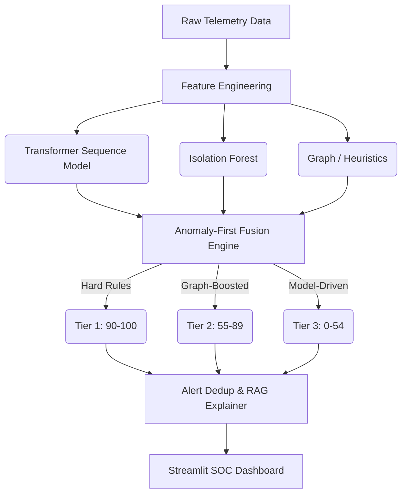

# ARGUS
**AI-Powered Behavioral Anomaly Detection for Cybersecurity**

ARGUS is a hybrid, multi-stage cybersecurity detection engine designed to identify anomalous entity behavior, insider threats, and sophisticated exfiltration campaigns. By fusing deterministic hard rules, graph-based structural heuristics, and deep sequence modeling, ARGUS provides a robust defense against attacks that evade traditional signature-based detection. It scales to massive log telemetry while maintaining operational precision and surfacing actionable, interpretable alerts to security analysts.

---

## Problem Statement

Modern enterprise networks generate immense volumes of raw telemetry (authentication logs, network flows, resource access). Finding a targeted, low-and-slow attack or a compromised insider in this data is a "needle in a haystack" problem characterized by:
- **Sequential/Behavioral Complexity:** Attacks unfold over time, not in single isolated events.
- **Extreme Class Imbalance:** Millions of benign events for every single malicious action.
- **Concept Drift:** Normal organizational behavior shifts constantly, causing models to decay.
- **Cold-Start Entities:** New users or devices lack historical baselines, throwing off standard anomaly detectors.
- **Explainability Constraints:** Security Operations Center (SOC) analysts cannot action "black-box" model alerts without knowing *why* the alert fired.

---

## How It Addresses the Problem

ARGUS tackles these fundamental challenges through a targeted, multi-tiered architecture:
- **Sequential/Behavioral Data:** A deep **Transformer sequence model** analyzes chronological session windows, natively understanding the temporal progression of user behavior and detecting subtle deviations over time.
- **Extreme Class Imbalance:** Instead of relying entirely on ML for rare attacks, ARGUS uses an **Anomaly-First Fusion** engine. Deterministic hard rules and structural graph-boosts guarantee detection of known vectors (like impossible travel), while unsupervised Isolation Forests map the vast baseline of "normal."
- **Concept Drift:** A dedicated **Drift Monitor** continuously tracks Kolmogorov-Smirnov (KS) statistics and Population Stability Index (PSI) against a strictly filtered (malicious/cold-start free) baseline, proactively alerting before model decay impacts production.
- **Cold-Start Problem:** Features like `entity_session_idx` allow the pipeline to isolate new entities. The fusion engine dynamically applies peer-group cohort thresholds (e.g., specific `new_device_edge_count` limits for IT Service Accounts vs. standard users) to prevent cold-start false positives.
- **Explainability:** ARGUS provides a natural-language **RAG Explainability Module** mapped to the MITRE ATT&CK framework. Every alert generates an analyst-ready summary explaining exactly which rules, features, and model signals triggered the score.

---

## Innovation / What Sets This Apart

ARGUS distinguishes itself from standard "black-box" ML detection platforms through rigorous diagnostic transparency and operational pragmatism:

1. **Anomaly-First Fusion Design:** Rather than hoping a single model learns everything, ARGUS enforces a strict hierarchy. Tier 1 is deterministic (hard rules score 90-100). Tier 2 uses graph heuristics (fan-out, lateral hops) to boost structural anomalies. Tier 3 is pure model-driven scoring (Transformer + Isolation Forest) mapped through a learned Logistic Regression calibration layer.
2. **Diagnostic Rigor Over Headline Metrics:** During development, a 100%-precision XGBoost model was rejected after diagnostic auditing revealed it was memorizing a trivial categorical feature shortcut. Similarly, an experimental severity-head Transformer was discarded when it was found to destabilize the primary detection probabilities. ARGUS favors robust, generalized detection over overfitted benchmarks.
3. **Calibrated Logistic Regression Fusion:** The final risk score is not an arbitrary arithmetic average. It is mathematically calibrated using Logistic Regression over `transformer_score`, `if_norm`, and `graph_boost`, optimizing the threshold margin and isolating the true detection boundary.
4. **OT/Enterprise Pragmatism:** Inspired by platforms like Honeywell Forge Cybersecurity+, ARGUS is built for operational reality. It acknowledges that some campaigns (like highly constrained insider drift) are designed to sit exactly on the detection boundary and must be managed via peer-group baselining.

---

## Architecture

ARGUS operates as a multi-layered batch pipeline:



1. **Data Generation & Feature Engineering:** Synthesizes realistic temporal campaigns and maps them to session-level rollups, graph edges, and categorical embeddings.
2. **Detection Core:**
   - **Isolation Forest:** Maps the multidimensional shape of benign traffic.
   - **Transformer:** Evaluates the chronological sequence of sessions.
   - **GNN/Graph Engine:** Computes lateral hop scores, distinct fan-outs, and new device connections.
3. **Anomaly-First Fusion:** Evaluates peer-group cohort thresholds, computes the Logistic Regression probability, applies the graph boost, and clips into final Tier bands (1, 2, or 3).
4. **Monitoring & Explainer:** RAG-based alert explanations mapped to MITRE ATT&CK, coupled with automated drift tracking.
5. **SOC Dashboard:** A Streamlit interface for live alert triaging, timeline visualization, and drift status monitoring.

---

## Results Achieved

Metrics represent the final, fully-calibrated system (Threshold = 75, Test Split = 3,280 sessions):

*   **Precision:** 0.9213
*   **Recall:** 1.000 (117/117 benchmark attacks detected)
*   **F1 Score:** ~0.959
*   **Normal FP Rate:** 0.32% (10 false positives / 3,163 normal sessions)

**Per-Class Recall Breakdown:**
*   `brute_force`: 3/3 (1.000)
*   `credential_misuse`: 3/3 (1.000)
*   `credential_stuffing`: 77/77 (1.000)
*   `device_spoofing`: 3/3 (1.000)
*   `impossible_travel`: 4/4 (1.000)
*   `lateral_movement`: 3/3 (1.000)
*   `low_and_slow_exfiltration`: 24/24 (1.000) — *(Note: 1.000 recall achieved after Logistic Regression fusion reweighting, previously limited to 0.542 under arithmetic fusion)*

**Documented Limitation:**
While `low_and_slow_exfiltration` recall is currently 1.000 on the test split, diagnostic tracing revealed this attack heavily challenges per-session scoring paradigms. Because these attacks generate only 1-2 minor events per session over a 7-day window, early sessions in the campaign yield extremely low confidence scores. Detection success relies heavily on the Transformer recognizing the later position-in-sequence signatures. Complete, robust detection of this class requires multi-session temporal window correlation, which remains the primary boundary of the current architecture.

---

## File Structure

```text
Argus/
├── data/                  # Raw, intermediate, and processed telemetry parquet files
├── experiments/           # Historical diagnostic reports, superseded scripts, and rejected models
├── notebooks/             # Exploratory data analysis (EDA) and prototyping notebooks
├── src/
│   ├── api/               # Backend API routes for serving predictions
│   ├── dashboard/         # Streamlit UI (app.py) and frontend visualization
│   ├── explain/           # RAG-based natural language explainability module
│   ├── fusion/            # Anomaly-First Fusion engine (anomaly_first_fusion.py, evaluate_fusion.py)
│   ├── graph/             # Graph heuristics and topological feature extractors
│   ├── ingest/            # Synthetic telemetry generation and feature engineering
│   ├── models/            # Core model definitions (Transformer, Isolation Forest)
│   └── monitoring/        # Concept drift monitor (drift_monitor.py, run_drift_check.py)
├── .gitignore             # Tracks codebase while excluding caches and large binary weights
├── README.md              # The document you are reading now
└── requirements.txt       # Production dependencies for Streamlit Cloud deployment
```

---

## Tech Stack

*   **Python 3.10+** (Core language)
*   **Pandas / NumPy / PyArrow:** High-performance tabular data manipulation and parquet storage.
*   **PyTorch (Local):** Deep learning framework powering the Transformer sequence model. *(Note: PyTorch is excluded from the deployed `requirements.txt` to maintain a lightweight Streamlit Cloud footprint, as the deployed dashboard visualizes pre-computed scores).*
*   **Scikit-Learn (Local):** Core library for the Isolation Forest and Logistic Regression calibration.
*   **NetworkX:** For computing graphical heuristics, subgraphs, and lateral movement hops.
*   **Streamlit & Altair:** For rapid, interactive, and data-rich SOC dashboard visualization.
*   **SciPy:** For Kolmogorov-Smirnov tests utilized in the concept drift monitor.

---

## Models Used

1. **Transformer Sequence Model (`sequence_model.py`):** Learns complex temporal patterns by processing a rolling window of historical session embeddings.
2. **Isolation Forest (`iforest_model.pkl`):** An unsupervised tree ensemble that establishes the baseline "shape" of normal traffic, explicitly detecting multidimensional outliers.
3. **Graph Engine (`graph/`):** Computes structural heuristics (fan-in/fan-out, distinct edge generation, short-path hops) to capture lateral relational changes.
4. **Hard-Rule Engine (`anomaly_first_fusion.py`):** Deterministic logic chains (e.g., fingerprint mismatch + geo-velocity) representing immutable security axioms.
5. **Logistic Regression (Fusion Layer):** A learned, calibrated mapping layer that optimally weighs Transformer, IF, and Graph scores to output the final 0-100 probability.

---

## How to Replicate

Clone the repository and install the full local development stack (including torch and scikit-learn, which are intentionally omitted from `requirements.txt` for Streamlit Cloud deployment):

```bash
git clone https://github.com/your-org/argus.git
cd argus
python -m venv venv
source venv/bin/activate  # (or `venv\Scripts\activate` on Windows)
pip install -r requirements.txt
pip install torch scikit-learn faker  # Required for local model training and generation
```

**Step-by-Step Execution:**
1. **Generate Dataset:** `python src/ingest/generate_dataset.py`
2. **Build Features:** `python src/ingest/build_features.py`
3. **Train Isolation Forest:** `python src/models/isolation_forest.py`
4. **Train Transformer:** `python src/models/sequence_model.py`
5. **Run Fusion Engine:** `python src/fusion/evaluate_fusion.py`
6. **Run Drift Sanity Check:** `python src/monitoring/run_drift_check.py`
7. **Launch Dashboard:** `streamlit run src/dashboard/app.py`

*Note: A live, read-only version of the dashboard with pre-computed evaluation data is hosted on Streamlit Community Cloud.*

---

## Potential Challenges and How They Were Tackled

The development of ARGUS prioritized uncovering and resolving deep ML failure modes rather than accepting superficial accuracy:

*   **Model Memorization via Dataset Artifacts:** Initially, an XGBoost model achieved 100% precision. Diagnostic auditing proved it was circumventing actual behavior analysis by memorizing an underlying PRNG state linked to `user_agent` strings. XGBoost was discarded in favor of the Transformer, and the dataset generator was rewritten with isolated PRNG instances per campaign.
*   **Cross-Contamination of Signals:** Early iterations of the `geo_velocity` check suffered from "probe contamination," where a malicious session's foreign IP established a new baseline for the victim, causing their *next* legitimate login to flag as impossible travel. This was fixed by enforcing an authenticated-only (`fp_mismatch == 0`) forward-fill constraint on the geo baseline.
*   **Peer-Group Normalization (Cold-Start FPs):** Strict hard-rules for `new_device_edge_count` falsely flagged IT Service Accounts doing routine mass updates. ARGUS was updated to dynamically compute 95th-percentile peer-group thresholds (mapping Entity Type and Department), preserving high detection rates while eliminating false positives from structurally high-fan-out benign entities.
*   **Drift Monitor Hallucinations:** The drift monitor initially flagged massive (8.7x) concept drift between the train and test normal sessions. Investigation revealed that the baseline was inadvertently contaminated with cold-start sessions (which have naturally high anomaly scores). By strictly filtering the train baseline to `is_malicious == False AND entity_session_idx > 2`, the baseline stabilized and the false drift alarm was cleared.
